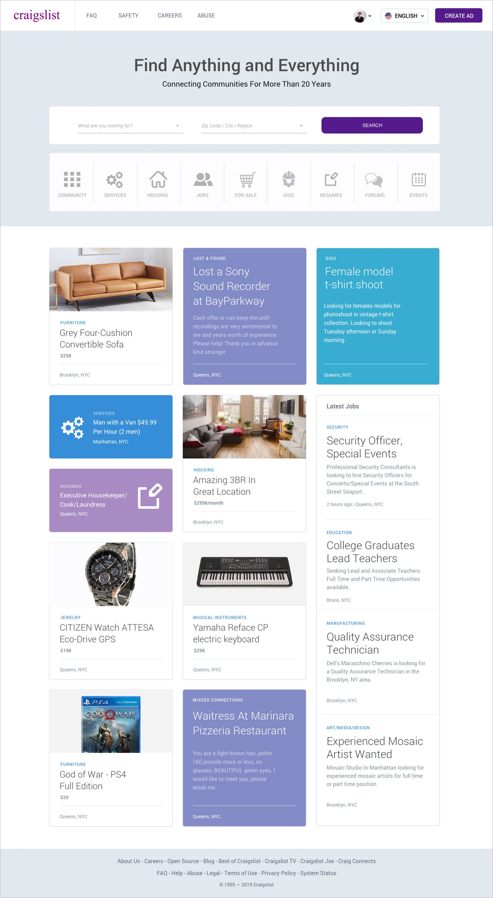

# Craigslist Redesign - Django and deployed to digital ocean

The objective is to integrate the design proposed by Rabih Shasha with django framework

Feel free to read his case study post
[Craigslist Redesign — a UI/UX Case Study](https://medium.com/@rabihshasha/craigslist-redesign-case-study-ui-ux-a10f2f1a9a83).



## Installation

### Create ane activate virtual environment
```bash
$ make venv
$ source env/bin/activate
$ make setup
```
## Development

### Run locally
Run with django web server |  Run with docker
:-------------------------:|:-------------------------:
```$ make up && make runsever```   | ```$ make up```

The development server : http://127.0.0.1:8000/

Admin panel: http://127.0.0.1:8000/admin

## Production
http://164.92.152.36/

## Usage

|Commands |Description  |
|---------|-------------|
|make clean| Clean up the __pycache__ folder |
|make venv| Create virtual environnement |
|make setup| Install dependencies |
|make build| Restart containers |
|make up| Start container |
|make down| Shutdown container  |
|make restart| Restart container |
|make app_db| Login inside database container |
|make app_web| Login inside database container |
|make runserver| Run django web server |
|make migration| Make migrations |
|make migrate| Apply migrations |
|make superuser| Create super user |
|make test| Run test |
|make lint | Lint |
|make ci | Run CI locally with act |
|make ssh | Connect to droplet ssh |
|make droplet-status | Get droplet status |
|make db-status | Get database status |
|make account | Get account digital ocean |